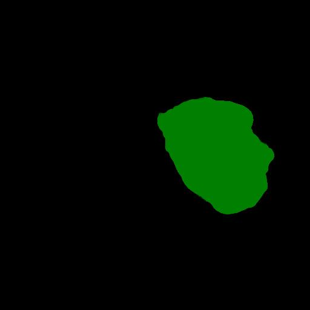

<h2>Tensorflow-Image-Segmentation-Kidney-Tumor (2024/10/28)</h2>

This is the second experiment for Kidney-Tumor Segmentation based on the latest 
<a href="https://github.com/sarah-antillia/Tensorflow-Image-Segmentation-API">Tensorflow-Image-Segmentation-API</a>, and
<a href="https://drive.google.com/file/d/1NhT0j9UF64hZA02vt6BGSDLvSJCJTBmD/view?usp=sharing">
Kidney-Tumor-ImageMask-Dataset.zip</a>, which was derived by us from the Kidney-Tumor-segmentation-dataset
<a href="https://kits19.grand-challenge.org/data/"><b>Kits19 Challenge Data</b></a>
 
 
On detail of our Kidney Tumor ImageMask Dataset, please refer to our first experiment  
<a href="https://github.com/sarah-antillia/Image-Segmentation-Kidney-Tumor">Image-Segmentatioin-Kidney-Tumor</a>
 
 

<b>Actual Image Segmentation for Images of 512x512 pixels</b> 
As shown below, the inferred masks look similar to the ground truth masks.  

<table>
<tr>
<th>Input: image</th>
<th>Mask (ground_truth)</th>
<th>Prediction: inferred_mask</th>
</tr>
<tr>
<td></td>
<td></td>
<td></td>
</tr>

<tr>
<td></td>
<td></td>
<td></td>
</tr>

<tr>
<td></td>
<td></td>
<td></td>
</tr>

</table>

We used the simple UNet Model <a href="./src/TensorflowUNet.py">TensorflowSlightlyFlexibleUNet</a> for this Follicular-Cell Segmentation. 
As shown in <a href="https://github.com/sarah-antillia/Tensorflow-Image-Segmentation-API">Tensorflow-Image-Segmentation-API</a>.
you may try other Tensorflow UNet Models: 

<li><a href="./src/TensorflowSwinUNet.py">TensorflowSwinUNet.py</a></li>
<li><a href="./src/TensorflowMultiResUNet.py">TensorflowMultiResUNet.py</a></li>
<li><a href="./src/TensorflowAttentionUNet.py">TensorflowAttentionUNet.py</a></li>
<li><a href="./src/TensorflowEfficientUNet.py">TensorflowEfficientUNet.py</a></li>
<li><a href="./src/TensorflowUNet3Plus.py">TensorflowUNet3Plus.py</a></li>
<li><a href="./src/TensorflowDeepLabV3Plus.py">TensorflowDeepLabV3Plus.py</a></li>
 

<h3>1. Dataset Citation</h3>

The image dataset used here has been taken from the following web site.
 
<b>The official [2019 KiTS Challenge]</b>

https://kits19.grand-challenge.org 

<b>The official 2019 KiTS Challenge repository.</b>

https://github.com/neheller/kits19 

Please see also: <a href="https://kits-challenge.org/kits23/">[KiTS23 Homepage]</a> 

<a href="https://kits19.grand-challenge.org/data/"><b>Challenge Data</b></a>
 

<b>License: </b>

The following applies to all content in this repository EXCEPT that within the data/ subdirectory. 
 
<b>MIT License</b> 

Copyright (c) 2019 Nicholas Heller 

Permission is hereby granted, free of charge, to any person obtaining a copy 
of this software and associated documentation files (the "Software"), to deal 
in the Software without restriction, including without limitation the rights 
to use, copy, modify, merge, publish, distribute, sublicense, and/or sell 
copies of the Software, and to permit persons to whom the Software is 
furnished to do so, subject to the following conditions: 

The above copyright notice and this permission notice shall be included in all 
copies or substantial portions of the Software. 
 
THE SOFTWARE IS PROVIDED "AS IS", WITHOUT WARRANTY OF ANY KIND, EXPRESS OR 
IMPLIED, INCLUDING BUT NOT LIMITED TO THE WARRANTIES OF MERCHANTABILITY, 
FITNESS FOR A PARTICULAR PURPOSE AND NONINFRINGEMENT. IN NO EVENT SHALL THE 
AUTHORS OR COPYRIGHT HOLDERS BE LIABLE FOR ANY CLAIM, DAMAGES OR OTHER 
LIABILITY, WHETHER IN AN ACTION OF CONTRACT, TORT OR OTHERWISE, ARISING FROM, 
OUT OF OR IN CONNECTION WITH THE SOFTWARE OR THE USE OR OTHER DEALINGS IN THE 
SOFTWARE. 

 

<h3>
<a id="2">
2 Kidney-Tumor ImageMask Dataset
</a>
</h3>
 If you would like to train this Kidney-Tumor Segmentation model by yourself,
 please download our blood-cell dataset from the google drive 
<a href="https://drive.google.com/file/d/1NhT0j9UF64hZA02vt6BGSDLvSJCJTBmD/view?usp=sharing">
Kidney-Tumor-ImageMask-Dataset.zip</a>, 
 expand the downloaded dataset and put it under <b>./dataset</b> folder to be

<pre>
./dataset
└─Kidney-Tumor
    ├─test
    │  ├─images
    │  └─masks
    ├─train
    │  ├─images
    │  └─masks
    └─valid
        ├─images
        └─masks
</pre>
 
 
<b>Kidney-Tumor Statistics</b> 
 

As shown above, the number of images of train and valid dataset is enough to use for our segmentation model.

 
 
<b>Train_images_sample</b> 

 
<b>Train_masks_sample</b> 

 

<h3>
3. Train Tensorflow UNet Model
</h3>
 We trained Kidney Tumor TensorflowUNet Model by using the configuration file
<a href="./projects/TensorflowSlightlyFlexibleUNet/Kidney-Tumor/train_eval_infer.config"> <b>train_eval_infer.config</b></a> file.  
Please move to ./projects/TensorflowSlightlyFlexibleUNet/Kidney-Tumor and run the following bat file. 
<pre>
>1.train.bat
</pre>
, which simply runs the following command. 
<pre>
>python ../../../src/TensorflowUNetTrainer.py ./train_eval_infer.config
</pre>

<b>Model parameters</b> 
Defined a small <b>base_filters</b> and a large <b>base_kernels</b> for the first Conv Layer of Encoder Block of 
<a href="./src/TensorflowUNet.py">TensorflowUNet.py</a> 
and a large num_layers (including a bridge between Encoder and Decoder Blocks).
<pre>
[model]
model          = "TensorflowUNet"
generator      = True
image_width    = 512
image_height   = 512
image_channels = 3
base_filters   = 16
base_kernels   = (9,9)
num_layers     = 8
dilation       = (1,1)
</pre>

<b>Learning rate</b> 
Defined a small learning rate.  
<pre>
[model]
learning_rate  = 0.0001
</pre>

<b>Online augmentation</b> 
Diabled our online augmentation. To enable it, set the generator to be True.
<pre>
[model]
model         = "TensorflowUNet"
generator     = False
</pre>

<b>Loss and metrics functions</b> 
Specified "bce_dice_loss" and "dice_coef". 
<pre>
[model]
loss           = "bce_dice_loss"
metrics        = ["dice_coef"]
</pre>
<b>Learning rate reducer callback</b> 
Enabled learing_rate_reducer callback with a small reducer_patience.
<pre> 
[train]
learning_rate_reducer = True
reducer_factor     = 0.4
reducer_patience   = 4
</pre>

<b>Early stopping callback</b> 
Enabled an early stopping callback with patience parameter.
<pre>
[train]
patience      = 10
</pre>

<b>Mask blurring and binarization</b> 
Enabled mask blurring and binarization.
<pre>
[mask]
blur      = True
blur_size = (3,3)
binarize  = True
threshold = 50
</pre>

<b>Epoch change inference callbacks</b> 
Enabled epoch_change_infer and epoch_change_tiledinfer callbacks. 
<pre>
[train]
epoch_change_infer      = True
epoch_change_infer_dir  = "./epoch_change_infer"
epoch_change_tiledinfer = False
epoch_change_tiledinfer_dir = "./epoch_change_tiledinfer"
num_infer_images        = 6
</pre>

By using these callbacks, on every epoch_change, the inference procedures can be called
 for 6 images in <b>mini_test</b> folder. These will help you confirm how the predicted mask changes 
 at each epoch during your training process.    

<b>Epoch_change_inference output</b> 
 
 
 
In this experiment, the training process was terminated at epoch 90 by the early stopping callback.  
 
 
 
<a href="./projects/TensorflowSlightlyFlexibleUNet/Kidney-Tumor/eval/train_metrics.csv">train_metrics.csv</a> 
 

 
<a href="./projects/TensorflowSlightlyFlexibleUNet/Kidney-Tumor/eval/train_losses.csv">train_losses.csv</a> 
 
 

<h3>
4.Evaluation
</h3>
Please move to a <b>./projects/TensorflowSlightlyFlexibleUNet/Kidney-Tumor</b> folder, 
and run the following bat file to evaluate TensorflowUNet model for Kidney-Tumor. 
<pre>
./2.evaluate.bat
</pre>
<pre>
python ../../../src/TensorflowUNetEvaluator.py ./train_eval_infer_aug.config
</pre>
Evaluation console output: 

 
The loss (bce_dice_loss) to this Kidney-Tumor test dataset was very low, and dice_coef very high as shown below.
 
<pre>
loss,0.0231
dice_coef,0.9618

</pre>

<h2>
5. Inference
</h2>
Please move to a <b>./projects/TensorflowSlightlyFlexibleUNet/Augmented-Follicular-Cell</b> folder 
,and run the following bat file to infer segmentation regions for images by the Trained-TensorflowUNet model for Follicular-Cell. 
<pre>
./3.infer.bat
</pre>
<pre>
python ../../../src/TensorflowUNetInferencer.py ./train_eval_infer_aug.config
</pre>
Sample test images 
 
Sample test mask (ground_truth) 
 

 
Inferred test masks 
 
 

<b>Enlarged images and masks of 512x512</b> 

<table>
<tr>
<th>Image</th>
<th>Mask (ground_truth)</th>
<th>Inferred-mask</th>
</tr>

<tr>
<td></td>
<td></td>
<td></td>
</tr>

<tr>
<td></td>
<td></td>
<td></td>
</tr>

<tr>
<td></td>
<td></td>
<td></td>
</tr>

<tr>
<td></td>
<td></td>
<td></td>
</tr>
<tr>
<td></td>
<td></td>
<td></td>
</tr>
<tr>
<td></td>
<td></td>
<td></td>
</tr>
</table>

 

 
<h3>
References
</h3>

<b>1. The official [2019 KiTS Challenge] </b> 
<a href="https://kits19.grand-challenge.org">
https://kits19.grand-challenge.org
</a>
 
 

<b>2. The official 2019 KiTS Challenge repository.</b> 
<a href="https://github.com/neheller/kits19">
https://github.com/neheller/kits19
</a>
 
 
<b>3. The state of the art in kidney and kidney tumor segmentation in contrast-enhanced CT imaging: Results of the KiTS19 challenge</b> 
Nicholas Heller, Fabian Isensee, Klaus H. Maier-Hein, Xiaoshuai Hou,  
Chunmei Xie, Fengyi Li, Yang Nan, Guangrui Mu, Zhiyong Lin,  
Miofei Han, Guang Yao, Yaozong Gao, Yao Zhang, Yixin Wang, Feng Hou,  
Jiawei Yang, Guangwei Xiong, Jiang Tian, Cheng Zhong, Jun Ma, Jack Rickman, 
Joshua Dean, Bethany Stai, Resha Tejpaul, Makinna Oestreich, Paul Blake,  
Heather Kaluzniak, Shaneabbas Raza, Joel Rosenberg, Keenan Moore, Edward Walczak,  
Zachary Rengel, Zach Edgerton, Ranveer Vasdev, Matthew Peterson, Sean McSweeney, 
Sarah Peterson, Arveen Kalapara, Niranjan Sathianathen, Nikolaos Papanikolopoulos, 
Christopher Weight 
<a href="https://www.sciencedirect.com/science/article/abs/pii/S1361841520301857?via%3Dihub">
https://www.sciencedirect.com/science/article/abs/pii/S1361841520301857?via%3Dihub
</a>
 
 
<b>4. Kidney Tumor Segmentation Based on FR2PAttU-Net Model</b> 
Peng Sun, Zengnan Mo, Fangrong Hu, Fang Liu, Taiping Mo, Yewei Zhang and Zhencheng Chen 
<a href="https://www.frontiersin.org/journals/oncology/articles/10.3389/fonc.2022.853281/full">
https://www.frontiersin.org/journals/oncology/articles/10.3389/fonc.2022.853281/full
</a>
 
 
<b>5. MSS U-Net: 3D segmentation of kidneys and tumors from CT images with a multi-scale supervised U-Net</b> 
Wenshuai Zhao, Dihong Jiang, Jorge Peña Queralta, Tomi Westerlund 
<a href="https://www.sciencedirect.com/science/article/pii/S2352914820301969">
https://www.sciencedirect.com/science/article/pii/S2352914820301969
</a>
 
 
<b>6. Image-Segmentation-Kidney-Tumor</b> 
Toshiyuki Arai @antillia.com 
<a href="https://github.com/sarah-antillia/Image-Segmentation-Kidney-Tumor">
https://github.com/sarah-antillia/Image-Segmentation-Kidney-Tumor
</a>
